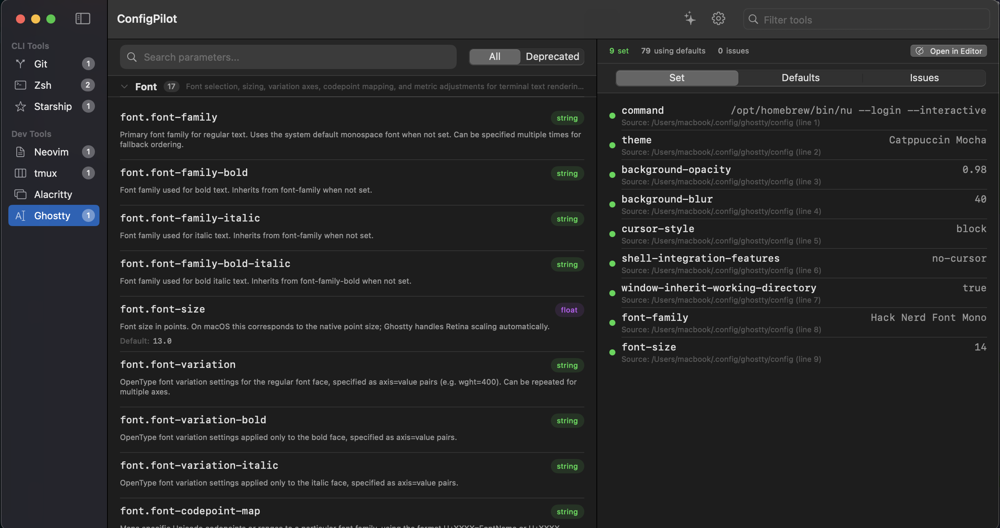

# CONFIGPILOT

Manage your configuration files with ease. View your current settings, edit them in your preffered editor, view the documentation and get AI recommendations. 

## Installation

(For now while the app is in development you can just run it from XCode, in the future hopefully it will be available on the App Store)


Clone this repo
```bash
git clone https://github.com/csepant/configpilot
```

Open in XCode and run the project.

## Screenshots

